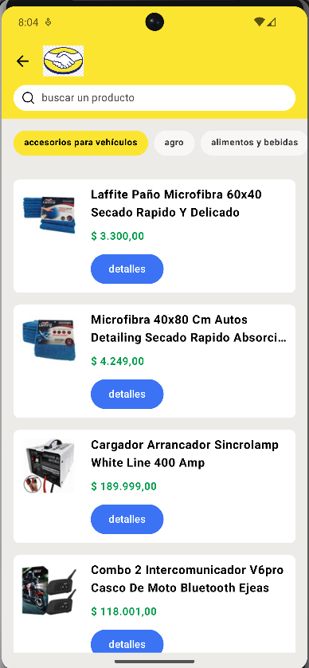
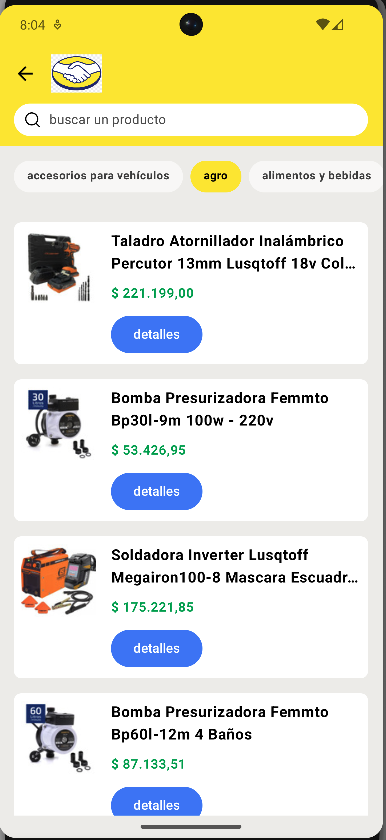
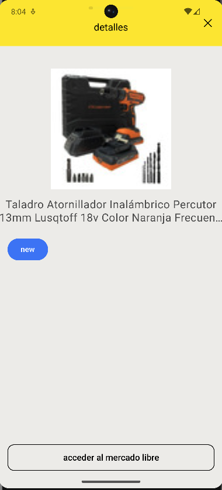
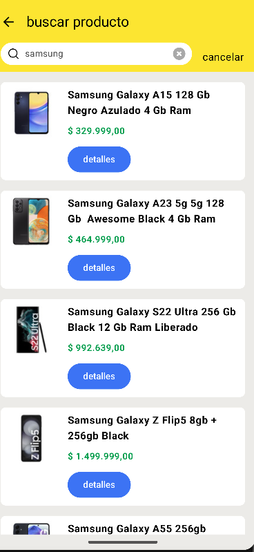

# ML Challenge - Setup Guide - by Lucas Esteves
## ML Challenge App | Android | Kotlin

Welcome to Mercado Libre Challenge project! This guide will walk you through setting up the environment to test the project on your local machine.

`Jetpack Compose` & `MVI Architecture`

## 📷 Previews

<p align="center">



</br>
</p>

## 🛠 Tech Stack & Open Source Libraries
- Minimum SDK level 24.
- 100% [Jetpack Compose](https://developer.android.com/jetpack/compose) based + [Coroutines](https://github.com/Kotlin/kotlinx.coroutines) + [Flow](https://kotlin.github.io/kotlinx.coroutines/kotlinx-coroutines-core/kotlinx.coroutines.flow/) for asynchronous.
- Jetpack
  - Compose: Android’s modern toolkit for building native UI.
  - ViewModel: UI related data holder and lifecycle aware.
  - App Startup: Provides a straightforward, performant way to initialize components at application startup.
  - Navigation: For navigating screens and [Koin Compose] for injecting dependencies.
  - [Koin]: Dependency Injection.
- [Coil]: Jetpack Compose image loading library.
- [Retrofit2 & OkHttp3](https://github.com/square/retrofit): Construct the REST APIs and paging network data.

## ✍️ Prerequisites

- Android Studio installed on your machine with Java 17.

## Getting Started

1. **Install Java 17:**

    ```
    https://www.oracle.com/java/technologies/javase/jdk17-archive-downloads.html
    ```

2. **Clone the Repository:**

    ```
    git clone https://github.com/lukesteves92/MLChallenge.git
    ```

3. **Open Project in Android Studio:**

    Open Android Studio and navigate to `File` > `Open` and select the cloned project directory.

4. **Set Java 17 by Default:**

   Open Android Studio and navigate to `File` > `Settings` > `Build, Execution...` > `Build Tools` > `Gradle` and select the new `Gradle SDK` downloaded, Java 17.

5. **Run the App:**

    - Build and run the ML Challenge app in Android Studio.

Congratulations! You have successfully set up the environment to test the Mercado Pago Challenge project on your local machine. If you encounter any issues, feel free to reach out for assistance. Enjoy!
